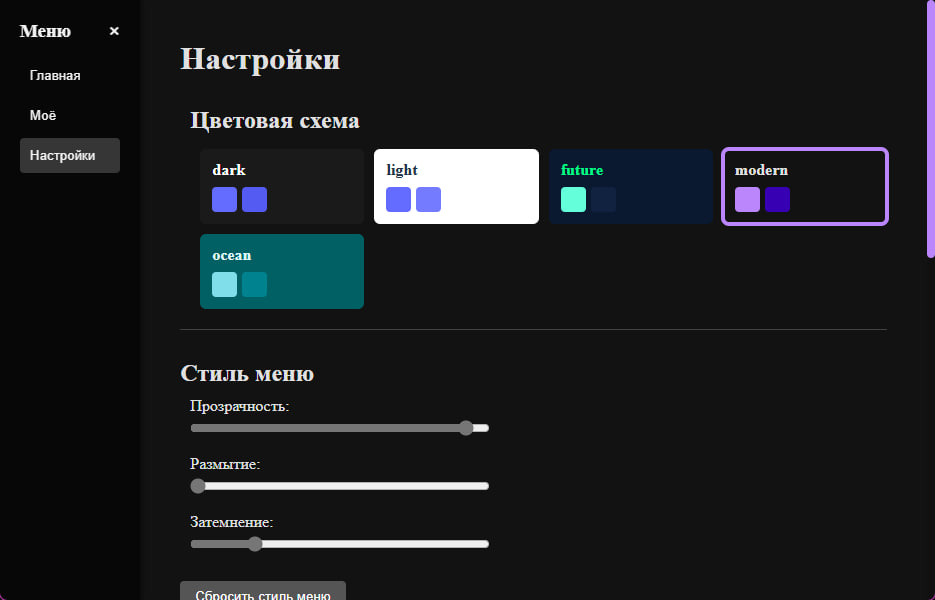
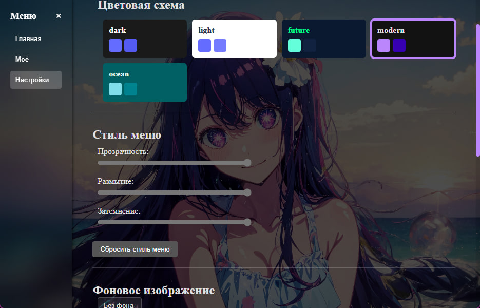

# tauri app macket

Description: this is a mock-up of a modern application on tauri + vite

---

## 🛠️ Technologies

The project was developed using the following technologies:

- **Tauri** — to create native applications.
- **Vite** — for a quick build of the frontend.
- **TypeScript (native)** — for code typing and reliability.

---

## 🖼️ screenshots of the interface







---

## 🚀 quick start

1. download:
   - [Node.js](https://nodejs.org/ )
   - [Rust](https://www.rust-lang.org/ ) (для Tauri)
   - [Tauri CLI](https://tauri.app/v1/guides/getting-started/prerequisites )

2. clone the repository:
   ```bash
   git clone https://github.com/Blank12980/modern-tauri-app-macket.git
   cd modern-tauri-app-macket

3. install the dependencies:
   ```bash
   npm i

4. start the app:
   ```bash
   npm run dev


